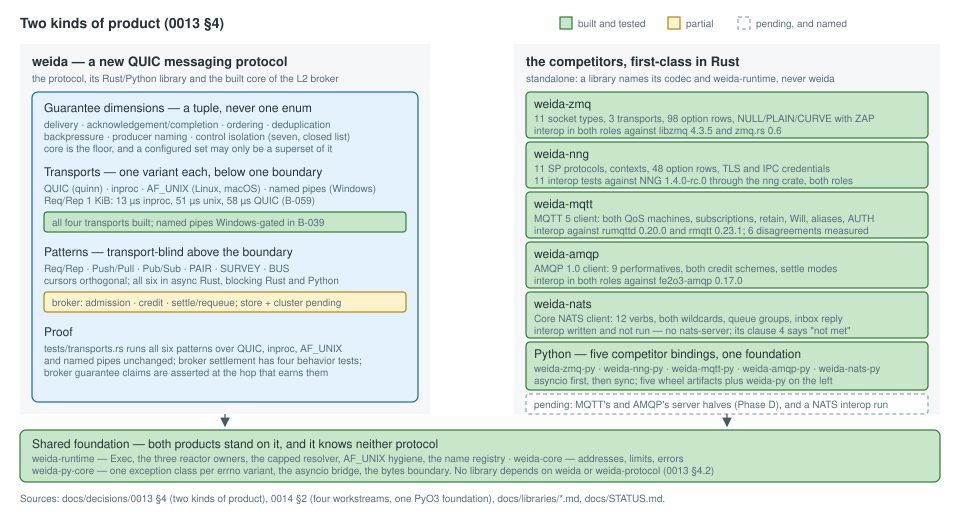
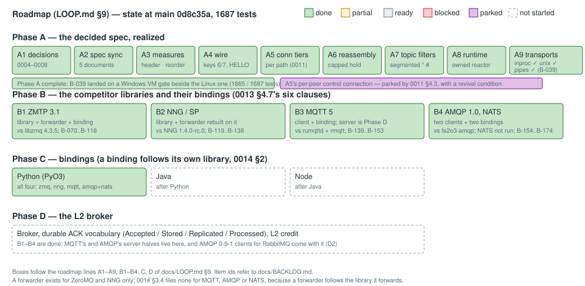
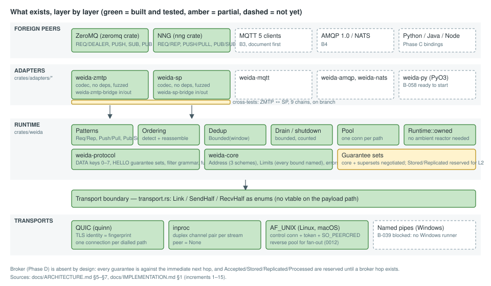
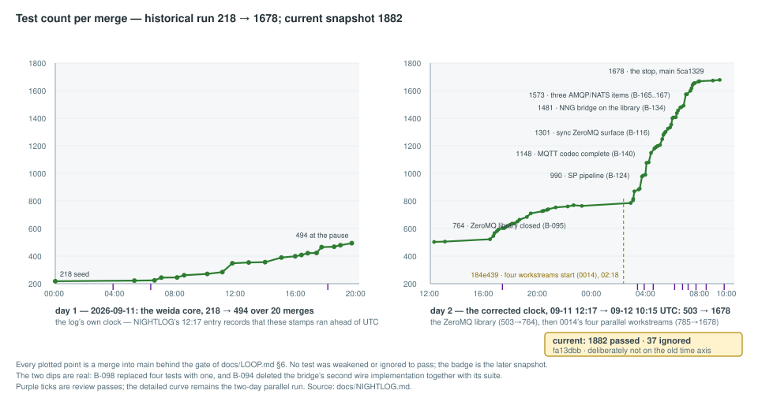
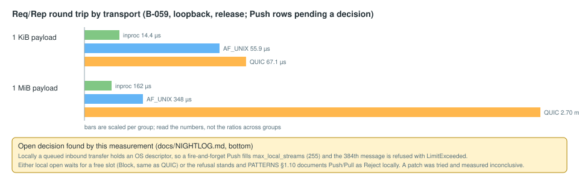

# Status

A one-page picture of where weida stands. Written for a reader who wants to see the shape of
the project before reading the detail; every number and status here is taken from
[NIGHTLOG.md](NIGHTLOG.md), [BACKLOG.md](BACKLOG.md) and [IMPLEMENTATION.md](IMPLEMENTATION.md)
at the commit named below, and those files remain the source of truth. The diagrams live in
`docs/status/` and are plain SVG; regenerate them by hand when the picture changes.

**Snapshot:** `main` at `fa13dbb`, 2026-09-15 16:22 UTC. Tree clean; the
[LOOP.md](LOOP.md) §6 gate is green on Linux: **1882 passed, 0 failed, 37
ignored** across the workspace, plus **854 passed** across the five default-off feature
configurations (`284 + 245 + 152 + 143 + 30`), both required clippy configurations, and the
workspace plus all ten explicit rustdoc configurations after `cargo clean --doc`.
`weida-py` adds **32** tests through a freshly built wheel. The four tests since the previous
snapshot are B-203's settlement proofs: a reported delivery leaves, a report lost with its
subscription requeues, `max_unsettled` stops and resumes one subscription, and an unsettled
message keeps its charge. Mutations that removed the requeue, the bound or the charge each made
the corresponding claim fail.

**Every surface of the library is now bound.** PAIR, SURVEY and BUS landed in the library
ahead of its facades and B-244 carried them into `weida::blocking` and both halves of
`weida-py`; B-243 did the same for the **cursor** surface, so a Python producer orders
`report=[weida.PROCESSED]` on a send and reads the verdict a one-way transfer has no reply to
carry. Two shapes were decisions rather than translations, and both came out the same way: a
survey is a **value** in Python (`weida.Survey`) and a cursor report is a **handle** read in a
`while (set := await cursors.changed()) is not None:` loop — because the only channel out of a
bridged future there is the errno family, so `async for` would need a second one invented for
`StopAsyncIteration` alone. A cursor **level is an integer**, since the level space is open
above `weida.APPLICATION_FLOOR` and a class would close what the protocol leaves open.

**A synchronous wait without a deadline is a hang, and B-243 found one of ours.** The blocking
`Cursors::changed(deadline)` is mandatory-deadline for the reason
[0009](decisions/0009-drain.md) §4.4 gives: a peer that never reports opens no stream, a report
that never starts never ends, and a connection both sides keep alive never closes, so a parked
thread would wait forever. The library gained `Cursors::changed_within(deadline)` and
`Reported::{Changed, Waiting, Ended}` — three outcomes, because a deadline is not an ending —
and `weida.sync.Cursors.changed(seconds)` raises `TimeoutError`. A mutation test that parked
for 300 seconds before the change fails in 15 after it.

**A 64-byte message is now twelve bytes of framing.** The guide's own C8B arithmetic found a
fixed 60-byte `traceparent` on every DATA header of every pattern — 44 % of the wire budget for
a message-to-everybody — and [0028](decisions/0028-trace-propagation-is-the-callers.md) settled
it on the honest argument rather than the byte count: a minted root is not a safe default but a
fabricated fact, because a hop that received a context and forgot to propagate it emitted a
*new trace* rather than nothing. A context is now propagated and never minted, so a 64-byte
push is **76 B at 192.6-195.9 Kmsg/s** against 135 B before, and weida is in ZMTP's and SP's
class on small messages instead of 71 bytes worse (B-246).

**There is now a document that teaches.** [GUIDE.md](GUIDE.md) is organised around one
question — **C8B: how do you scale a software system to eight billion people?**, this project's
C10K, utopian on purpose — and every program in it is a file in the tree that a test drives
([0026](decisions/0026-the-guide-and-the-c8b-question.md)). §0's arithmetic is the part that
earns the framing: at this repository's own measured numbers, **two to four hops reach
everybody**, which makes the hard problem at that scale neither throughput nor depth but what
a hop may claim — and an acknowledgement per recipient converging on one root is 1.1 TB for one
message. **Chapters 1 and 2 are written** — ten claims exercised by the guide test — and the
remaining broker chapters are filed slice by slice (B-258..B-261). The former cross-protocol
chapter was removed with the rejected general bridge product category. Guarantee negotiation
remains explicit: a live connection carries the set its runtime configured, and a peer
requiring more is refused at connect time rather than silently given less
([0027](decisions/0027-the-negotiated-set-is-the-configured-set.md)).
Two document corrections came with it: HELLO keys `5` and `6` **are** on the wire, retiring a
stale "spec ahead of code" caveat, and the website item had been sitting at `ready` for three
rounds after the site shipped.

**The fan-out width the whole argument rests on is now measured** (B-247), and it moved the
argument rather than confirming it. Per subscriber: **396-436 KiB** of transport state at widths
16 and 256, **88.8 ns** of publisher CPU per message, **507-539 µs** of median idle latency at
width 256. So neither memory nor CPU binds at 10⁴ subscribers — the **delivery rate** does, at
**276-279 Kcopies/s**, which is 36 ms of a node's capacity for one message to 10⁴ subscribers
and about 27 messages per second at that width. The width interval in the guide survived
(10³-10⁴) for a different reason than the one it was derived from. A second measured answer
settles how a fan-out fails: a stalled subscriber is refused by the **byte budget** when that
budget is below the connection's 0.6-1.5 MiB absorption band and by the **queue** when it is
above it — which is why `dropped_on(topic)` separates the two causes.
The latest successful Windows proof remains `d26da7e`: **1853 passed across 142 binaries**,
0 failed and 37 ignored, with fmt, both clippy configurations and rustdoc clean. It is not a
proof of this snapshot: the VM was rebuilt after the btrfs/QEMU cache fault was fixed and the
fresh guest currently has no cargo, rustc, git or MSVC, so the manual gate cannot run until its
toolchain is restored. The old result and its twelve storage-shaped failures stay in the
nightlog rather than being presented as current evidence.

There are **six Python bindings**: the five competitor libraries plus `weida-py`, each with an
asyncio and a synchronous surface on the shared `weida-py-core` foundation. The newest one is
the first that reaches every weida pattern and its cursor surface. **Thirty decision notes
(0001–0030): fourteen `accepted` and sixteen `provisional`.** The newest two are
[0029](decisions/0029-a-report-is-relayed-a-certificate-is-not.md), which separates a relayed
report from a hop-local certificate, and
[0030](decisions/0030-which-runtimes-and-in-which-order.md), which fixes Phase C's order as
Python, Node, Erlang, C, Java.

One binary, `weida` (B-060), sits beside the library, and `weida::blocking` (B-194) beside the
async API. **Twenty-five `[workspace] members`**, read from `cargo metadata`: `weida-core`,
`weida-protocol`, `weida-runtime`, `weida-winpipe`, `weida`, `weida-broker`,
`crates/raft/weida-raft`, `crates/py/{weida-py-core, weida-py}`, then
`crates/zmq/{weida-zmtp, weida-zmq, weida-zmq-py}`,
`crates/nng/{weida-sp, weida-nng, weida-nng-py}`,
`crates/mqtt/{weida-mqtt-codec, weida-mqtt, weida-mqtt-py}`,
`crates/amqp/{weida-amqp-codec, weida-amqp, weida-amqp-py}`,
`crates/nats/{weida-nats-codec, weida-nats, weida-nats-py}` and `crates/site`. The site
renders this document set rather than maintaining a second one and remains unpublished while
the workspace has no release form.

The two halves of that picture are the two products of
[0013](decisions/0013-competitor-libraries.md) §4: weida on the left, with the guarantee
dimensions, transports and patterns it offers, and the five standalone foreign-protocol
libraries on the right. They share runtime foundations but no implicit semantic conversion.

## 1. The roadmap

Reading it: **Phase A is complete.** Its last slice, named pipes (A9, B-039), waited for a
Windows runner rather than for a design, and landed the day one existed: the same 0012
grouping over `\\.\pipe\`, gated on the VM beside the Linux gate. The control-connection
tier (A5) is not a gap: decision 0011 parks it with a revival condition, because no existing
or reserved frame is peer-scoped. The last open question in it, what a local `open` does at
its ceiling, is answered: it **waits for a slot**, so `Block` means the same thing on every
transport (B-059).

**Phase B is complete across all four slices, and Phase C's Python row is complete across all
six bindings.** The sixty-six items of
[0014](decisions/0014-parallel-libraries.md) built the five competitor libraries and their
bindings, each binding following its own library, asyncio first and synchronous second:

- **B1 ZeroMQ** — `weida-zmq` and `weida-zmq-py`: eleven socket types against
  `zmq_socket(3)`'s twenty rows, three transports, NULL/PLAIN/CURVE with the ZAP dialog, a
  98-row option table decided row by row, the monitor, the devices, nine zguide recipes and
  interop in both roles against libzmq 4.3.5.
- **B2 nanomsg SP** — `weida-nng` and `weida-nng-py`: one socket type per protocol, the
  endpoint engine, a 48-row option table, TLS and IPC credentials, and **eleven interop tests
  against NNG 1.4.0-rc.0 through the `nng` crate**. That interop found two library bugs no
  unit test had.
- **B3 MQTT 5** — `weida-mqtt` and `weida-mqtt-py`, a **client**: the server half is Phase D
  ([0014](decisions/0014-parallel-libraries.md) §2), so its parity table adds a fourth verdict
  and says why. Interop ran against **two** brokers, `rumqttd` 0.20.0 and `rmqtt` 0.23.1, and
  measured **six** disagreements with the specification.
- **B4 AMQP 1.0 and Core NATS** — `weida-amqp`, `weida-nats` and both bindings: nine
  performatives, both credit schemes, the settle modes and dispositions, interop in both roles
  against `fe2o3-amqp` 0.17.0 — and NATS interop **written and not run**, because no
  `nats-server` was reachable, which its parity table records as a clause **not met** rather
  than rounding up.

What that leaves in Phase C is the order fixed by
[0030](decisions/0030-which-runtimes-and-in-which-order.md): **Node, Erlang, C, Java**. Phase D
is no longer untouched: the in-memory broker admits and confirms, delivers under cumulative
credit, and settles or requeues a delivery. DATA key `12`, report relay and `retire(deadline)`
are the three ready continuations; stores, replication, MQTT's and AMQP's server halves and
AMQP 0-9-1 clients remain later Phase D work.

## 2. What exists, layer by layer

The load-bearing line is the **transport boundary**: `Link`, `SendHalf`, `RecvHalf` as enums in
`crates/weida/src/transport.rs`. Everything above it is transport-blind, and
`tests/transports.rs` now runs **all six patterns** over QUIC, inproc, `AF_UNIX` and, on
Windows, named pipes. Below it the two kernel-mediated transports share one implementation of
the 0012 grouping and the same per-write framing, generic over what a socket and a pipe differ
in; that shared framing is what made an interrupted `AF_UNIX` stream distinguishable from FIN
(B-245).

The **reactor is its own crate** now: `weida-runtime` holds `Exec`, the three reactor-ownership
constructors, the capped resolver, the `AF_UNIX` and named-pipe hygiene and the name
registry, and it depends on `weida-core`, `tokio` and — on Windows only — `weida-winpipe`,
the one crate in the tree that may use `unsafe`, fifteen Win32 calls behind a safe surface —
which is what lets a ZeroMQ user open a socket
without linking quinn, rustls and weida's pattern layer. Above it the tree is **one directory
per protocol family** (`crates/zmq/`, `crates/nng/`, `crates/interop/`) rather than one
`adapters/` bucket, so the directory list answers "does this repository ship a ZeroMQ?". Each
codec crate still has an **empty `[dependencies]`** section, so it can be checked against its
RFC rather than against our reading of it; each library depends on the codec and the runtime
and never on `weida`; each forwarder is the only crate that names both sides. The review pass
of B-051 found the session's first two unbounded remote-influenced allocations in a bridge
rather than in the core, and B-097 found two more in the new library — so the invariant sweep
covers the foreign-protocol crates too, and every bound they added is named where it is taken.

**Completions are cursors, on a stream of their own.** `weida::Cursors`, `weida::CursorSet` and
`weida::Reporter` (B-233, B-240) are the acknowledgement surface of
[0023](decisions/0023-completion-is-a-cursor.md) and
[0024](decisions/0024-three-families-one-back-channel.md): a sender orders levels per transfer
with `TransferMeta::with_report` and reads absolute byte offsets back on frame kind `6`, a
unidirectional stream that never shares a stream with payload. Two properties are structural
rather than promised. **No pattern's topology changes**: a Push transfer that orders cursors is
still one unidirectional stream, proved against a raw `quinn` peer because the library's own API
cannot assert it. And **nothing waits on a cursor**: a sender that never reads its cursors blocks
no transfer, a receiver that never reports fails none, and the level space is open — `0..=15` is
weida's ladder, `16` and above is the application's, carried and ordered but never interpreted.
`weida-broker` is the first user: a Push producer that orders `Accepted` gets it at the admitted
body length on **one unidirectional stream**, with no exchange and no reply half, while an
exchange's publisher confirm stays the DATA key `8` reply it always was. A level the broker
cannot reach — `Stored`, with no store — is absent from the report rather than failed, which is
`GUARANTEES.md` §1's prohibition seen from the reporting side.

**The broker now owns a delivery until somebody reports it processed.** B-201 admits and
confirms at `Accepted`; B-202 registers ordinary subscribers and delivers under their
cumulative credit; B-203 moves each delivery into an `unsettled` table **without releasing its
`queue_bytes` charge**. The consumer's `Processed` cursor settles it, while a report that ends
without one requeues it at the head. `max_unsettled` is a live per-subscription bound, not a
clamp on lifetime credit. What is not built is kept separate and named: B-267 exposes the
attempt count on DATA key `12`, B-268 relays a consumer report toward the producer under the
producer's report id, and B-269 adds `retire(deadline)`.

**The pattern family is complete.** Req/Rep, Push/Pull and Pub/Sub were already there; PAIR,
SURVEY and BUS (B-236, B-237, B-238) close
[ARCHITECTURE.md](ARCHITECTURE.md) §6b's table and with it the nanomsg set — and they cost
**no wire vocabulary at all**: a `weida::Paired` talks to a bare `Peer` and `Acceptor` on the
same path, a `Respondent`'s route is byte-for-byte a replier's, a `BusMember`'s is a puller's.
Each needed exactly one thing the mapping had not seen, and each is where a hand-built version
goes wrong: PAIR refuses a second peer with `LIMIT_EXCEEDED` and **keeps the first**, a survey
counts a late reply where it arrives rather than where the caller reads, and a bus needs a
writer per member — without one a single member that stops reading blocks the sender.

## 3. Progress by the numbers

Every plotted point in the two panels is a merge into `main` behind the gate that existed when
the parallel run was made. The detailed curve deliberately stops at that run's two-day stop
(`5ca1329`, 1678 passed); the diagram now carries a separate, explicitly non-time-scaled current
badge instead of pretending the intervening three days fit the old axis. That badge is the
snapshot above: **1882 passed at `fa13dbb`, 37 ignored**. The two dips in the historical curve
are real deletions: B-098 replaced four weaker tests with one, and B-094 removed the bridge's
second wire implementation together with its suite.

## 5. The measurements that decided something

| Question | Number | What it decided |
| --- | --- | --- |
| Two extra DATA keys per message | +80 B, −9 % msg/s (B-009) | producer identity travels as a 32-byte `bstr`, not hex (0008 §4.4) |
| Reorder buffer under reverse completion | peak N − 1; 84 of 256 unforced (B-010) | `max_reorder_hold` is a configured number, default 256 |
| Second connection per peer | 1.05 ms handshake, ~1 MiB per pair (B-011/012) | one connection per dialled path is affordable (B-017) |
| Segment matcher in the fan-out path | 14 ns per filter, shape-independent (B-021) | the grammar is not the cost; registry iteration is |
| Parking a drain receipt on drop | first cut −3 %, per-connection inside noise (B-032) | per-connection parking; "dropping a Delivery is free" rewritten |
| Dedup key allocation | ~10 ns; the fix measures the same (B-040) | key left alone, with the number beside it |
| Local transports against QUIC | Req/Rep 1 KiB 13 µs inproc, 51 µs unix, 58 µs QUIC; Push 1 KiB 24 µs unix against 8 µs QUIC (B-059) | a local `open` waits for a slot, and 0010 §4.2's "the connection is the stream" is priced: free at 1 MiB, the whole cost at 1 KiB |

## 6. What needs a human

No unresolved design question gates the next ready item. Six entries record what was decided,
what remains deliberately manual and which machine fact currently limits a second-platform
proof.

1. **B-203 is built, not waiting on the conversation any more.**
   [0029](decisions/0029-a-report-is-relayed-a-certificate-is-not.md) supplied the rule; B-203
   supplied settlement and requeue. A queue's own certificate remains `Accepted`, while the
   consumer's `Processed` is a report that may be relayed as the consumer's — never invented,
   never re-relayed. No visibility timer was added: QUIC retransmits lost packets, a lost
   subscription requeues, and a live but silent consumer is bounded by `max_unsettled`.
   The three consequences intentionally split out are ready as B-267, B-268 and B-269.
2. **Phase C's order and the PyPy answer are written down.**
   [0030](decisions/0030-which-runtimes-and-in-which-order.md) records **Python, Node, Erlang,
   C, Java**: one N-API artifact targets Node, Bun and Deno; Rustler can send completions into a
   BEAM mailbox; the C ABI serves runtimes without a Rust-native bridge; Java stays last rather
   than being dropped. B-266 answered **no** to a second PyPy client: the measured cost is one
   event-loop wakeup per `await`, not bytecode. B-265, the separate Erlang-distribution sheet,
   is parked until the Erlang row.
3. **The website and CI are parked by the owner, not blocked on code.** The site renders **58
   pages** from this tree and fails its build on a dangling link, but remains local while the
   workspace is unpublished and untagged (B-254). CI is the owner's separate project (B-061);
   this tree supplies a reproducible gate rather than a workflow file.
4. **The gate's blind spots are closed.** LOOP §6 names all five default-off configurations and
   ten explicit rustdoc configurations, with `cargo clean --doc` first. The feature matrix had
   850 tests when the rule was measured and has **854 now**, because B-203 added four broker
   tests that also run with `cluster`.
5. **Windows stays manual and its toolchain currently needs rebuilding.** The btrfs/QEMU
   `cache=none` failure was fixed by creating the VM images with `No_COW`; the replacement guest
   is reachable but has no Rust, git or MSVC yet, so `C:\work\gate.ps1` is not presently
   runnable. The unrelated 980 PRO mounted at `/mnt/win` still reports 630 media/data-integrity
   errors and still needs the owner's backup.
6. **The two peer-visible review decisions are closed.** A trace context is propagated and
   never minted ([0028](decisions/0028-trace-propagation-is-the-callers.md), B-246), taking a
   64-byte push from 135 B to **76 B**; and the named-pipe chunk framing is now shared with
   `AF_UNIX`, so cancellation cannot read as successful FIN (B-245).

## 7. Where the loop stands

- **Nothing is in flight and the tree is clean at `fa13dbb`.** The required Linux gate is green
  at **1882 passed, 0 failed, 37 ignored**, the five default-off configurations add **854
  passed**, and all ten rustdoc configurations are clean after the doc cache is removed. The
  only unrun cross-check is Windows, for the missing guest toolchain named above; no LOOP §6
  configuration is red.
- **8 items are `ready`, 16 are `blocked`, 4 are `parked`; of 265 filed items, 237 are
  `done`.** The ready list is exact: B-267, B-268 and B-269 finish the broker outcome sequence,
  then B-231, B-226, B-219, B-220 and B-224 are the five cluster/store slices. The first three
  are independent cuts rather than one hidden mega-item: wire-visible attempt count, report
  relay across two connections, and finite queue retirement. Every surface already built in
  Rust is bound in `weida::blocking` and both `weida-py` halves.
- **The requirement-driven backlog is closed.** All five requests of
  [requirements/zeughaus-video.md](requirements/zeughaus-video.md) are answered where they were
  filed: streaming fan-out **built** (B-064, `Publisher::open`), conflation **answered without a
  key** (B-065, [0016](decisions/0016-conflation.md)), peer authorization **answered "neither"**
  (B-066, [0015](decisions/0015-peer-authorization.md)), per-topic drop counters **built**
  (B-067), and the dependency form blocked on the licence above (B-068).
- **What the previous session closed**: B-177 (split a `weida-zmq` socket into halves — the library diff
  *removes* 691 lines while adding 493, because the pattern bodies the whole sockets had are now
  shared), B-096 (a byte ceiling per peer queue, where a message count never was one), B-064
  (streaming fan-out), B-060 (the `weida` binary, Phase 11's first slice) with B-195..B-197 on
  top of it, B-194 (`weida::blocking`), B-065, B-066, B-193 and the two consequence passes
  B-191/B-192, plus the evidence passes on B-107, B-184 and B-068. Ten items were filed to
  replenish the backlog (B-191..B-200) and a review pass was logged at `db5c144`: 0 new
  findings, and the allocation sweep's best answer is that the pipe transport's chunk header
  declares a `u32` length and allocates **nothing** from it.
- **What this session closed:** the acknowledgement model, the complete pattern family and the
  first useful outcome half of the broker. B-233/B-239/B-240 built frame kind `6`, cursors,
  report modes and reporter-owned granularity; B-236/B-237/B-238 built PAIR, SURVEY and BUS;
  B-242 proved the failure matrix; B-243 and B-244 carried every new surface into blocking Rust
  and Python. B-203 then made a delivery a retained responsibility rather than a deletion:
  settle on `Processed`, requeue when the report disappears, and retain the byte charge while
  unsettled. [0029](decisions/0029-a-report-is-relayed-a-certificate-is-not.md) records why a
  report may travel where a certificate may not, and
  [0030](decisions/0030-which-runtimes-and-in-which-order.md) records the runtime order instead
  of leaving it as an assertion in the roadmap.
- **A coherence sweep closed the session**, seven parallel read-only audits over code, docs,
  decision notes, bindings and the five foreign-protocol libraries. Fifteen incoherences, all
  of the same four kinds: counts that had become false, superseded claims (including
  `GUARANTEES.md` contradicting itself on whether an acknowledgement level has a wire
  representation), former adapter mappings that treated protocol similarities as global, and
  claims of completeness in the surfaces this plan deliberately left alone. The only code
  finding was settled by a test rather than an argument: `tests/transports.rs` now runs **all
  six patterns** over every transport, and `pair_over_unix` is the first thing here that proves
  the reverse pool of 0012 §4.4 carries an ordinary send rather than a fan-out copy.
- **What moves next is no longer a human choice:** B-267 is the first ready item. It puts
  `delivery_attempt` on DATA key `12` without mixing that wire change into B-203's behavior
  slice; B-268 and B-269 follow. The five ready cluster/store slices stay behind those three in
  backlog order. Node is the next Phase C row by 0030, but no binding item has been filed or
  started.
