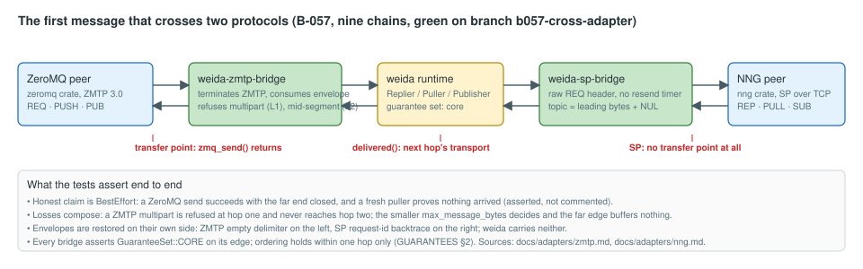

# Status

A one-page picture of where weida stands. Written for a reader who wants to see the shape of
the project before reading the detail; every number and status here is taken from
[NIGHTLOG.md](NIGHTLOG.md), [BACKLOG.md](BACKLOG.md) and [IMPLEMENTATION.md](IMPLEMENTATION.md)
at the commit named below, and those files remain the source of truth. The diagrams live in
`docs/status/` and are plain SVG; regenerate them by hand when the picture changes.

**Snapshot:** main `cff962b`, 2026-09-14 ~17:00 UTC. Tree clean, gate green on Linux:
**1862 tests** (218 at the start of the session, 764 before the four parallel workstreams) with
37 ignored — the interop suites that need a library or a broker the machine does not have —
plus `weida --features blocking` at **237**, 1 ignored. Fifty-eight of those tests arrived in
the last three rounds: twenty-four regression tests from the review, seventeen that hold the
website to the document set it renders, and seventeen that hold **the guide** to the programs
it teaches with. The intermittent failure this snapshot used to
carry a caveat about is **found and fixed**: it was a port race in the cross-protocol tests,
not a timing assertion (B-252).

**There is now a document that teaches.** [GUIDE.md](GUIDE.md) is organised around one
question — **C8B: how do you scale a software system to eight billion people?**, this project's
C10K, utopian on purpose — and every program in it is a file in the tree that a test drives
([0026](decisions/0026-the-guide-and-the-c8b-question.md)). §0's arithmetic is the part that
earns the framing: at this repository's own measured numbers, **two to four hops reach
everybody**, which makes the hard problem at that scale neither throughput nor depth but what
a hop may claim — and an acknowledgement per recipient converging on one root is 1.1 TB for one
message. **Chapters 1, 2 and 4 are written** — fifteen claims, fifteen programs, seventeen
tests — and the rest of the arc is filed slice by slice, in the order of what can be asserted
rather than of the chapter numbers (B-258..B-261). Chapter 4 is the cross-protocol chain
(ZeroMQ → ZMTP bridge → weida → SP bridge → nng, both foreign ends the real implementations),
and it demonstrates the sentence the whole C8B argument turns on: the ZeroMQ send succeeds,
nothing arrives at the SP end, neither protocol lied, and
**`BestEffort` ∩ `BestEffort` = `BestEffort`**. Writing it found one real gap: **no public
accessor reports what a live connection negotiated** although three documents describe the
agreed set as a property of a connection (B-262, filed; the chapter's test asserts the gap, so
closing it fails that test on purpose).

**The fan-out width the whole argument rests on is now measured** (B-247), and it moved the
argument rather than confirming it. Per subscriber: **396-436 KiB** of transport state at widths
16 and 256, **88.8 ns** of publisher CPU per message, **507-539 µs** of median idle latency at
width 256. So neither memory nor CPU binds at 10⁴ subscribers — the **delivery rate** does, at
**276-279 Kcopies/s**, which is 36 ms of a node's capacity for one message to 10⁴ subscribers
and about 27 messages per second at that width. The width interval in the guide survived
(10³-10⁴) for a different reason than the one it was derived from. A second measured answer
settles how a fan-out fails: a stalled subscriber is refused by the **byte budget** when that
budget is below the connection's 0.6-1.5 MiB absorption band and by the **queue** when it is
above it — which is why `dropped_on(topic)` separates the two causes.
The Windows 11 VM ran at this round's bookkeeping commit (`752f7b7`): **1835 across 141
binaries**, the same 37 ignored, in one clean pass — fmt, clippy in both configurations and
rustdoc included, with the guide's suite among the binaries. Add
the non-default feature runs (`weida-zmq` and `weida-mqtt`'s `blocking`, `weida-nng`'s
`blocking` and `nng-interop`) and the four bindings' Python suites: **45**
(MQTT), **36** (NATS) and **17** (AMQP) re-run here on merge, ZeroMQ's and SP's in their own
items, and **every one of the four wheels built and smoke-tested with no Rust toolchain on
`PATH`**. Twenty-six decision notes (0001–0026): fourteen `accepted` and twelve
`provisional` — 0015 (peer authorization), 0016 (conflation) and 0017 (the subscription
verdict) because each answers an open question with a wire-affecting "no"; 0018 (the minimal
broker) and 0019 (the JVM binding) because they are the first step of a phase the user
chooses; 0020–0024 (the cluster, consensus, the store, one control group, the cursor and the
three families) because they are the phase now being built; 0025 (the website) because
what a site may claim is settled by a release that does not exist yet; and 0026 (the guide and
the C8B question) because the question is a framing the owner set and the arc it implies is
still being written.
One binary, `weida` (B-060), beside the library, `weida::blocking` (B-194) beside the async API,
and **`weida-py`** (B-200, B-204, B-205), the sixth Python binding in the tree, the first of
weida itself, the only one that reaches every pattern of its library including the streamed
fan-out, and — like the other five — with an asyncio surface and a `sync` one. **Twenty-eight
`[workspace] members`**, one directory per protocol family, read off `cargo metadata` rather
than a hand-kept list: `weida-core`, `weida-protocol`, `weida-runtime`, `weida-winpipe`,
`weida`, `weida-broker`, `crates/raft/weida-raft`, `crates/py/{weida-py-core, weida-py}`,
then
`crates/zmq/{weida-zmtp, weida-zmq, weida-zmq-bridge, weida-zmq-py}`,
`crates/nng/{weida-sp, weida-nng, weida-nng-bridge, weida-nng-py}`,
`crates/mqtt/{weida-mqtt-codec, weida-mqtt, weida-mqtt-py}`,
`crates/amqp/{weida-amqp-codec, weida-amqp, weida-amqp-py}`,
`crates/nats/{weida-nats-codec, weida-nats, weida-nats-py}`, `crates/interop/cross-tests`
and `crates/site` — the last of which is the website at
[weida.doodleshnookie.net](https://weida.doodleshnookie.net), rendered from the documents in
this directory rather than written beside them
([0025](decisions/0025-the-website.md)), and the one member that is `publish = false`.

The two halves of that picture are the two products of
[0013](decisions/0013-competitor-libraries.md) §4: weida on the left, with the guarantee
dimensions, transports and patterns it offers, and the five foreign-protocol libraries on the
right, each with what was measured against a real peer and what is still pending — joined only
by the two forwarders in the middle and by the shared foundation both stand on.

## 1. The roadmap

Reading it: **Phase A is complete.** Its last slice, named pipes (A9, B-039), waited for a
Windows runner rather than for a design, and landed the day one existed: the same 0012
grouping over `\\.\pipe\`, gated on the VM beside the Linux gate. The control-connection
tier (A5) is not a gap: decision 0011 parks it with a revival condition, because no existing
or reserved frame is peer-scoped. The last open question in it, what a local `open` does at
its ceiling, is answered: it **waits for a slot**, so `Block` means the same thing on every
transport (B-059).

**Phase B is complete across all four slices, and Phase C's Python row with it** — sixty-six
items of [0014](decisions/0014-parallel-libraries.md) in four parallel workstreams, each
library the definition of done of
[0013](decisions/0013-competitor-libraries.md) §4.7 and each binding following its own
library, asyncio first and synchronous second:

- **B1 ZeroMQ** — `weida-zmq` and `weida-zmq-py`: eleven socket types against
  `zmq_socket(3)`'s twenty rows, three transports, NULL/PLAIN/CURVE with the ZAP dialog, a
  98-row option table decided row by row, the monitor, the devices, nine zguide recipes,
  interop in both roles against libzmq 4.3.5, and a forwarder rebuilt on the library that lost
  1352 lines.
- **B2 nanomsg SP** — `weida-nng` and `weida-nng-py`: one socket type per protocol, the
  endpoint engine, a 48-row option table, TLS and IPC credentials, **eleven interop tests
  against NNG 1.4.0-rc.0 through the `nng` crate**, and the bridge rebuilt on the library —
  780 insertions against 731 deletions, which is what a rebuild should look like. That rebuild
  found two library bugs no unit test had.
- **B3 MQTT 5** — `weida-mqtt` and `weida-mqtt-py`, a **client**: the server half is Phase D
  ([0014](decisions/0014-parallel-libraries.md) §2), so its parity table adds a fourth verdict
  and says why. Interop ran against **two** brokers, `rumqttd` 0.20.0 and `rmqtt` 0.23.1, and
  measured **six** disagreements with the specification.
- **B4 AMQP 1.0 and Core NATS** — `weida-amqp`, `weida-nats` and both bindings: nine
  performatives, both credit schemes, the settle modes and dispositions, interop in both roles
  against `fe2o3-amqp` 0.17.0 — and NATS interop **written and not run**, because no
  `nats-server` was reachable, which its parity table records as a clause **not met** rather
  than rounding up.

What that leaves: **Phase C's Java and Node rows**, untouched and unfiled; **Phase D**, the L2
broker, which is also where MQTT's and AMQP's server halves live; and the five parity
documents' own open questions, each named in its document rather than here.
AMQP 0-9-1 (RabbitMQ) is deliberately not a Phase B adapter: its clients come with the broker (D2), and B4's AMQP 1.0 client already reaches RabbitMQ 4.x.

## 2. What exists, layer by layer

The load-bearing line is the **transport boundary**: `Link`, `SendHalf`, `RecvHalf` as enums in
`crates/weida/src/transport.rs`. Everything above it — frames, HELLO, negotiation, the three
patterns, ordering, dedup, drain — is transport-blind, and `tests/transports.rs` proves that by
running one Req/Rep, one Push/Pull and one Pub/Sub body over QUIC, inproc, `AF_UNIX` and, on
Windows, named pipes unchanged. Below it the two kernel-mediated transports share one
implementation of the 0012 grouping, generic over what a socket and a pipe differ in; the
pipe's one addition is a chunk framing, because a pipe has no half-close.

The **reactor is its own crate** now: `weida-runtime` holds `Exec`, the three reactor-ownership
constructors, the capped resolver, the `AF_UNIX` and named-pipe hygiene and the name
registry, and it depends on `weida-core`, `tokio` and — on Windows only — `weida-winpipe`,
the one crate in the tree that may use `unsafe`, fifteen Win32 calls behind a safe surface —
which is what lets a ZeroMQ user open a socket
without linking quinn, rustls and weida's pattern layer. Above it the tree is **one directory
per protocol family** (`crates/zmq/`, `crates/nng/`, `crates/interop/`) rather than one
`adapters/` bucket, so the directory list answers "does this repository ship a ZeroMQ?". Each
codec crate still has an **empty `[dependencies]`** section, so it can be checked against its
RFC rather than against our reading of it; each library depends on the codec and the runtime
and never on `weida`; each forwarder is the only crate that names both sides. The review pass
of B-051 found the session's first two unbounded remote-influenced allocations in a bridge
rather than in the core, and B-097 found two more in the new library — so the invariant sweep
covers the foreign-protocol crates too, and every bound they added is named where it is taken.

**Completions are cursors, on a stream of their own.** `weida::Cursors`, `weida::CursorSet` and
`weida::Reporter` (B-233, B-240) are the acknowledgement surface of
[0023](decisions/0023-completion-is-a-cursor.md) and
[0024](decisions/0024-three-families-one-back-channel.md): a sender orders levels per transfer
with `TransferMeta::with_report` and reads absolute byte offsets back on frame kind `6`, a
unidirectional stream that never shares a stream with payload. Two properties are structural
rather than promised. **No pattern's topology changes**: a Push transfer that orders cursors is
still one unidirectional stream, proved against a raw `quinn` peer because the library's own API
cannot assert it. And **nothing waits on a cursor**: a sender that never reads its cursors blocks
no transfer, a receiver that never reports fails none, and the level space is open — `0..=15` is
weida's ladder, `16` and above is the application's, carried and ordered but never interpreted.
`weida-broker` is the first user: a Push producer that orders `Accepted` gets it at the admitted
body length on **one unidirectional stream**, with no exchange and no reply half, while an
exchange's publisher confirm stays the DATA key `8` reply it always was. A level the broker
cannot reach — `Stored`, with no store — is absent from the report rather than failed, which is
`GUARANTEES.md` §1's prohibition seen from the reporting side.

**The pattern family is complete.** Req/Rep, Push/Pull and Pub/Sub were already there; PAIR,
SURVEY and BUS (B-236, B-237, B-238) close
[ARCHITECTURE.md](ARCHITECTURE.md) §6b's table and with it the nanomsg set — and they cost
**no wire vocabulary at all**: a `weida::Paired` talks to a bare `Peer` and `Acceptor` on the
same path, a `Respondent`'s route is byte-for-byte a replier's, a `BusMember`'s is a puller's.
Each needed exactly one thing the mapping had not seen, and each is where a hand-built version
goes wrong: PAIR refuses a second peer with `LIMIT_EXCEEDED` and **keeps the first**, a survey
counts a late reply where it arrives rather than where the caller reads, and a bus needs a
writer per member — without one a single member that stops reading blocks the sender.

## 3. The first message across two protocols

This is roadmap slice B(6) and the reason both mapping documents were written in one shape.
The chain's honest guarantee is `BestEffort`, and the test asserts that rather than implying
more: ZMTP's `delivered()` proves the ZeroMQ hop's transport, SP has no transfer point at all,
so a ZeroMQ send succeeds with the NNG side closed and nothing arrives. The composed losses —
a multipart refused at hop one, the smaller `max_message_bytes` deciding — are each one test.

## 4. Progress by the numbers

Every point is a merge into main behind the four-step gate of [LOOP.md](LOOP.md) §6. **The
chart stops at the two-day stop it was drawn for** (`5ca1329`, 1678 tests); the sessions since
took it to **1803** without changing its shape, so it is left as the picture of the parallel run
rather than redrawn per merge. Two things it does not show: three review findings were caught **before** their merge by reading
the branch (a reassembler counter that drifted on repeated sequence numbers, a runtime-wide
mutex on the fire-and-forget path that cost 3 % in the header bench, a parked receipt that
held an OS descriptor), and three of the four findings of the ZMTP interop run were mistakes in
our own code that no unit test could have seen without an independent implementation on the
other end.

## 5. The measurements that decided something

| Question | Number | What it decided |
| --- | --- | --- |
| Two extra DATA keys per message | +80 B, −9 % msg/s (B-009) | producer identity travels as a 32-byte `bstr`, not hex (0008 §4.4) |
| Reorder buffer under reverse completion | peak N − 1; 84 of 256 unforced (B-010) | `max_reorder_hold` is a configured number, default 256 |
| Second connection per peer | 1.05 ms handshake, ~1 MiB per pair (B-011/012) | one connection per dialled path is affordable (B-017) |
| Segment matcher in the fan-out path | 14 ns per filter, shape-independent (B-021) | the grammar is not the cost; registry iteration is |
| Parking a drain receipt on drop | first cut −3 %, per-connection inside noise (B-032) | per-connection parking; "dropping a Delivery is free" rewritten |
| Dedup key allocation | ~10 ns; the fix measures the same (B-040) | key left alone, with the number beside it |
| Local transports against QUIC | Req/Rep 1 KiB 13 µs inproc, 51 µs unix, 58 µs QUIC; Push 1 KiB 24 µs unix against 8 µs QUIC (B-059) | a local `open` waits for a slot, and 0010 §4.2's "the connection is the stream" is priced: free at 1 MiB, the whole cost at 1 KiB |

## 6. What needs a human

Four things:

1. **Whether anything is published, and from where** — the one question the website makes
   concrete. The licence half of this is **settled and done**: `MIT OR Apache-2.0` with both
   files in the tree, `repository` and `homepage` in `[workspace.package]`, and `cargo package
   --workspace --no-verify` clean for every publishable crate (B-068). What is left is not
   mechanical: there is **no release** — no crate on any registry, no tag, no binary — and
   `crates/site` renders a site that nothing serves. Two answers are yours: which host serves
   `weida.doodleshnookie.net`, and whether the site goes up before there is something to
   install. Until then the site says so on every page and B-254 holds the work
   ([0025](decisions/0025-the-website.md) §4.6).
2. **Two sentences in [LOOP.md](LOOP.md) §6** (B-184 and B-107). The loop does not edit its own
   standing instructions, so the checks are run by hand and recorded in each item's note. They
   are not theoretical: running B-184's own command this session found a third `cfg`-gated
   intra-doc link — `Identity::generate` in `crates/weida/src/config.rs` — which failed
   `cargo doc -p weida --no-default-features` and was invisible to every `--workspace` doc run
   ever made here. It is fixed; the instruction that would have caught it is yours. B-107 is
   the same shape for the `blocking` feature, re-verified this session at 245, 150 and 138
   tests for `weida-zmq`, `weida-mqtt` and `weida-nng`.
3. **The Windows gate is manual.** The VM that unblocked B-039 (`ssh win11-geselle`) is in no
   CI, so `C:\work\gate.ps1` runs beside the Linux one by hand, and B-061's CI is where that
   would stop being true — itself `blocked`, because the Forgejo host has 2 vCPUs, 3 GB of RAM
   and a 600 s job limit. The VM's storage also throws `STATUS_IN_PAGE_ERROR` mid-compile
   every few hours; each occurrence is a corrupted artifact cleared by hand, never a code
   problem.
4. **Two decisions the review round filed rather than took**, because each changes what a peer
   observes: whether every DATA header keeps paying for an unconditional 55-byte `traceparent`
   (B-246 — it is the largest single item in a 135-byte frame for a 64-byte push, against
   ZMTP's one to nine bytes and SP's eight, and no decision note justifies it), and which shape
   closes the `AF_UNIX` reset loss (B-245 — per-write framing as the named-pipe transport has
   it, or one end-of-stream marker per transfer and a nine-byte lookahead in the reader; the
   kernel offers no third option, which was measured rather than assumed).

## 7. Where the loop stands

- **Nothing is in flight and every branch is merged.** The four workstreams of
  [0014](decisions/0014-parallel-libraries.md) are drained — sixty-six filed items, **68 merge
  commits** since `184e439`, checked branch by branch rather than taken on report — the gate is
  green at **1852 tests** with 37 ignored on Linux, and the tree is clean. **No known red**, in
  any configuration, including the ten rustdoc and three `blocking` runs that are not in the
  gate yet and were run by hand this session. The one caveat this section used to carry — a
  failure in roughly one full-workspace run in twenty that nobody had seen — is **closed**:
  the website's own gate run kept its log, the failure named itself
  (`an_nng_push_reaches_a_zmq_pull`, `AddrInUse`), and it was a probe-then-bind port race in
  a cross-test helper rather than the timing assertion it looked like (B-252).
- **17 items are `ready`, 19 are `blocked`** (B-061, CI: the Forgejo host cannot run this
  gate; B-254, serving the site; four guide chapters, each on the slice it
  needs; the rest waiting on an item this session is
  building or on a toolchain this machine does not have) and **one is `parked`** (A5's control
  tier by 0011 §4.3). Of **258** filed items, **221 are `done`**, and the `ready` ones are six
  kinds: **five slices of the cluster and store phase** (B-219, B-220, B-224, B-226, B-231),
  **the surfaces this session's work has not reached yet** (B-243, the cursor API in the two
  Python halves; B-244, the three new patterns in `weida::blocking` and both Python halves),
  **six findings the review round filed rather than fixed** (B-245 the `AF_UNIX` reset loss,
  B-246 the unconditional `traceparent`, B-248 the `unsafe` guard,
  B-249 the parked-receipt sweep, B-250 the per-message header allocations, B-251 one refusal
  table — B-247's fan-out measurement is now taken), **the website** (B-253, built; B-254,
  serving it, blocked on the owner), **the gap writing the guide found** (B-262, a live
  connection's negotiated guarantee set is not observable), and
  **two sentences in a file this loop does not write** (§6, B-107 and B-184).
  Nothing else is open: every requirement-driven item, every library item and both binding
  slices of weida's own Python surface are closed.
- **The requirement-driven backlog is closed.** All five requests of
  [requirements/zeughaus-video.md](requirements/zeughaus-video.md) are answered where they were
  filed: streaming fan-out **built** (B-064, `Publisher::open`), conflation **answered without a
  key** (B-065, [0016](decisions/0016-conflation.md)), peer authorization **answered "neither"**
  (B-066, [0015](decisions/0015-peer-authorization.md)), per-topic drop counters **built**
  (B-067), and the dependency form blocked on the licence above (B-068).
- **What the previous session closed**: B-177 (split a `weida-zmq` socket into halves — the library diff
  *removes* 691 lines while adding 493, because the pattern bodies the whole sockets had are now
  shared), B-096 (a byte ceiling per peer queue, where a message count never was one), B-064
  (streaming fan-out), B-060 (the `weida` binary, Phase 11's first slice) with B-195..B-197 on
  top of it, B-194 (`weida::blocking`), B-065, B-066, B-193 and the two consequence passes
  B-191/B-192, plus the evidence passes on B-107, B-184 and B-068. Ten items were filed to
  replenish the backlog (B-191..B-200) and a review pass was logged at `db5c144`: 0 new
  findings, and the allocation sweep's best answer is that the pipe transport's chunk header
  declares a `u32` length and allocates **nothing** from it.
- **What this session closed**: the acknowledgement model and the pattern family. **B-233**
  (frame kind `6`, the cursor stream, with four golden vectors and a fuzz target), **B-239** and
  **B-240** (the cursor API in `weida`, two report modes and a granularity that is the
  reporter's own), the broker reporting `Accepted` as a cursor so a Push producer gets a
  reliable verdict on one unidirectional stream (0024 §4.4a), **B-236**, **B-237** and **B-238**
  (PAIR, SURVEY and BUS, which complete `ARCHITECTURE.md` §6b's table and the nanomsg set), and
  **B-242** (the failure matrix `PATTERNS.md` §1.11 claimed and nothing tested). Four decision
  notes were **corrected by building them**: 0024 §4.4 (the head frame names a `report_id`, not
  QUIC's `StreamId`, which exists on one of four transports), 0024 §4.3 (two wire modes, not
  three — a `{bytes, interval}` pair in a header *is* a negotiated granularity, which 0023 §4.5
  forbids), B-236's own acceptance (PAIR is one-way transfers both ways) and B-239's
  (`final-only` is not byte-for-byte the classic confirm and cannot be).
- **A coherence sweep closed the session**, seven parallel read-only audits over code, docs,
  decision notes, bindings and the five foreign-protocol libraries. Fifteen incoherences, all
  of the same four kinds: counts that had become false, superseded claims (including
  `GUARANTEES.md` contradicting itself on whether an acknowledgement level has a wire
  representation), adapter mappings that still refused a pattern weida now ships, and claims
  of completeness in the surfaces this plan deliberately left alone. The only code finding was
  settled by a test rather than an argument: `tests/transports.rs` now runs **all six
  patterns** over every transport, and `pair_over_unix` is the first thing here that proves
  the reverse pool of 0012 §4.4 carries an ordinary send rather than a fan-out copy.
- **What moves the roadmap next** is yours to choose: **Phase D**, the L2 broker, where B-203's
  two parked design questions are now answered — consumer settlement is a cursor, so a delivery
  stays one-way — or **Phase C's Java row**. The two surfaces this session deliberately did not
  reach are filed: B-243 (cursors in `weida-py`) and B-244 (PAIR, SURVEY and BUS in
  `weida::blocking` and both Python halves).
